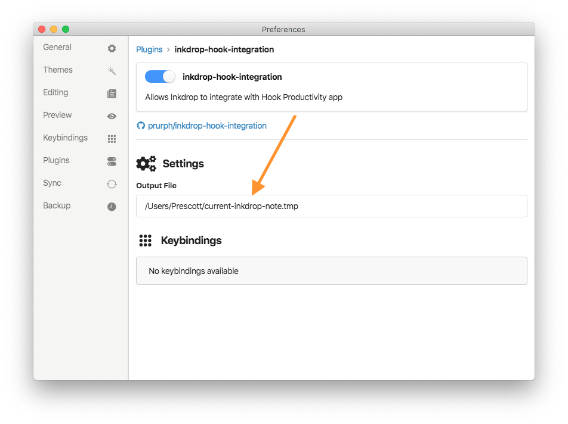
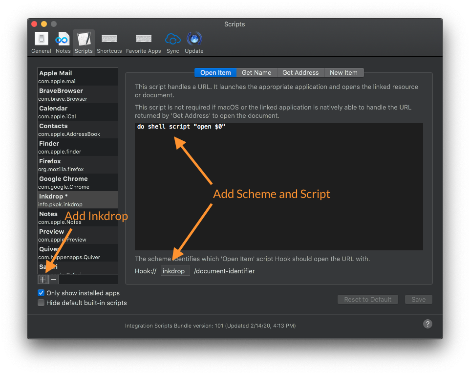
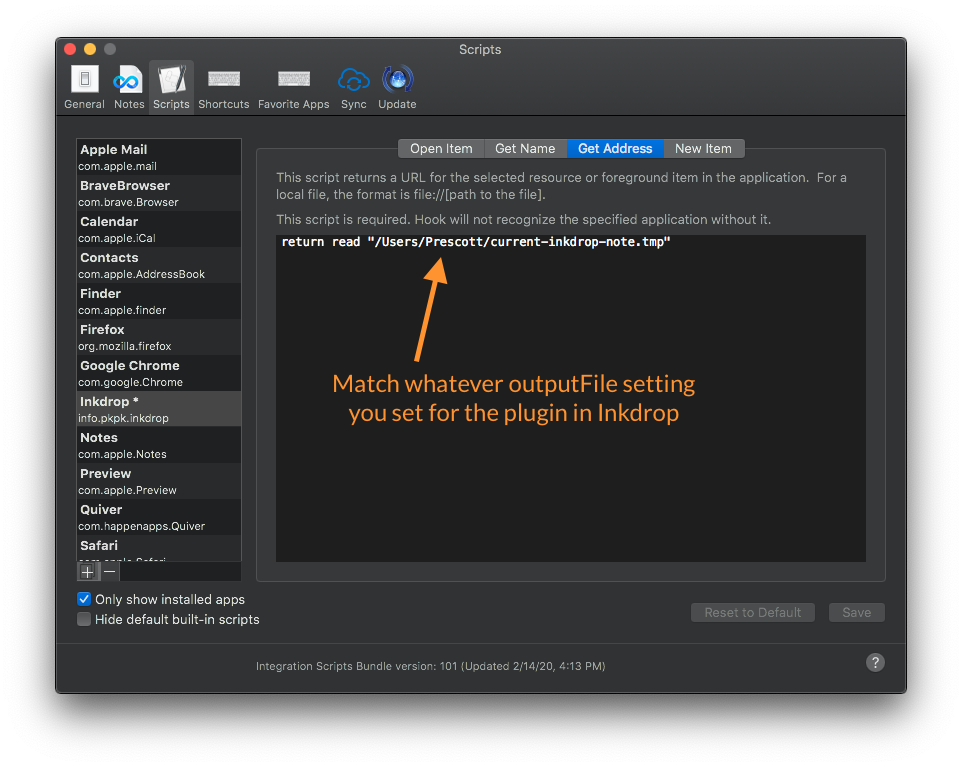

# Inkdrop Hook Integration
This is a simple plugin to allow a hacky integration with [Hook](https://hookproductivity.com).

It works as follows:
- The plugin writes a temp file to a defined location with the Inkdrop link to the *note being actively edited in Inkdrop*.
- You must do some very minor manual configuration of Hook (described below) to read this file so links can be generated.

> Please be careful; this is blindly writing a file to a configurable location on your disk. If you set it to something important, you could overwrite it.

## Installing
1. Install this package for Inkdrop: `ipm install inkdrop-hook-integration`
2. Configure the path to write the file under this plugin's settings in
.
3. Add Inkdrop scripts to Hook:
  1. Open Hook > Preferences > Scripts
  2. Click "+" and select Inkdrop to add it as a new app
  3. Fill in the following things under the "Open Item" and "Get Address" tabs: (see images below)
    - In "Open Item": `do shell script "open $0"` and set the scheme to `inkdrop`
    - In "Get Address": `return read "<path-to-your-tmpfile>"` (this path *must match whatever is set in the plugin*)
  4. Quit and restart Hook (ymmv: I found I had to restart for the script settings to take effect)

